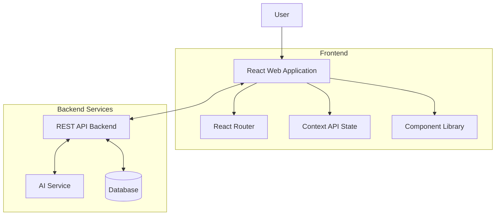

# ARCHITECTURE.md
Tourism Intelligent Platform - React Web Client Architecture

# Architecture Overview
This document provides a comprehensive understanding of the Tourism Intelligent Platform React web client architecture, designed for scalable tourism management with AI-powered features.

---

## 1. Project Structure

This is a **single-page React application** with a component-based architecture:

```
[Project Root]/
|-- public/
|   |-- index.html           # HTML template
|   |-- vite.svg            # Vite logo
|
|-- src/
|   |-- components/         # Reusable UI components
|   |   |-- UI/             # Base UI components (Button, Card)
|   |   |-- Layout/         # Layout components (Header, Sidebar, Footer)
|   |   |-- Header/         # Navigation header
|   |   |-- Sidebar/        # Main navigation
|   |   |-- Footer/         # Site footer
|   |   |-- Auth/           # Authentication components
|   |
|   |-- contexts/           # React Context providers
|   |   |-- AuthContext.jsx     # Authentication state management
|   |   |-- ThemeContext.jsx    # Theme and UI preferences
|   |   |-- TravelContext.jsx   # Travel data state
|   |
|   |-- hooks/              # Custom React hooks
|   |   |-- useAuth.js          # Authentication utilities
|   |   |-- useLocalStorage.js  # Local storage management
|   |   |-- useDebounce.js      # Debounce functionality
|   |   |-- useApi.js           # API request hooks
|   |
|   |-- pages/              # Page components
|   |   |-- Home/               # Landing page
|   |   |-- Dashboard/          # User dashboard
|   |   |-- AIAssistant/        # AI chat interface
|   |   |-- TravelPlanning/     # Trip planning tools
|   |   |-- BusinessDashboard/  # Business management
|   |   |-- Auth/               # Login/Register pages
|   |   |-- Profile/            # User profile
|   |   |-- Social/             # Community features
|   |
|   |-- services/           # API service layer
|   |   |-- api.js              # Axios configuration
|   |   |-- authService.js      # Authentication API
|   |   |-- travelService.js    # Travel-related API
|   |   |-- businessService.js  # Business management API
|   |   |-- aiService.js        # AI assistant API
|   |
|   |-- App.jsx             # Main application component
|   |-- main.jsx           # Application entry point
|   |-- index.css          # Global styles
|
|-- .env.example           # Environment variables template
|-- .eslintrc.cjs         # ESLint configuration
|-- index.html            # HTML template
|-- package.json          # Dependencies and scripts
|-- vite.config.js        # Vite configuration
|-- README.md             # Project documentation
|-- ARCHITECTURE.md       # This file
```

---

## 2. High-Level System Architecture



---

## 3. Frontend Architecture

### 3.1. Component Structure

**Layout Components:**
- `Layout.jsx` - Main layout wrapper
- `Header.jsx` - Navigation and user menu
- `Sidebar.jsx` - Main navigation menu
- `Footer.jsx` - Site footer

**UI Components:**
- `Button.jsx` - Reusable button with variants
- `Card.jsx` - Flexible content containers

**Page Components:**
- `Home.jsx` - Landing page
- `Dashboard.jsx` - User dashboard with statistics
- `AIAssistant.jsx` - Chat interface for AI assistance
- `TravelPlanning.jsx` - Trip planning tools
- `BusinessDashboard.jsx` - Business management interface

### 3.2. State Management

**Context Providers:**
- `AuthContext.jsx` - User authentication and authorization
- `ThemeContext.jsx` - UI theme and layout preferences  
- `TravelContext.jsx` - Travel data and trip management

**Custom Hooks:**
- `useAuth.js` - Authentication utilities and permissions
- `useLocalStorage.js` - Local storage management
- `useDebounce.js` - Debounce functionality
- `useApi.js` - API request handling

### 3.3. API Service Layer

**Service Modules:**
- `api.js` - Axios configuration and interceptors
- `authService.js` - Authentication endpoints
- `travelService.js` - Travel and trip management
- `businessService.js` - Business dashboard APIs
- `aiService.js` - AI assistant integration

---

## 4. Key Features Implementation

### 4.1. Authentication System
- JWT-based authentication
- Protected routes with role-based access
- Login/Register forms with validation
- User session management

### 4.2. AI Assistant Interface
- Real-time chat interface
- Message history management
- Typing indicators
- Quick suggestion buttons
- Context-aware responses

### 4.3. Travel Planning Tools
- Destination search and filtering
- Trip creation and management
- Itinerary builder
- Budget planning
- Interest-based recommendations

### 4.4. Business Dashboard
- Revenue analytics
- Booking management
- Service performance tracking
- Customer insights
- Promotion management

---

## 5. Technology Stack

**Core Technologies:**
- React 18 - Component framework
- Vite - Build tool and dev server
- React Router v6 - Client-side routing
- Axios - HTTP client
- Lucide React - Icon library

**Styling:**
- CSS with CSS variables
- Component-specific stylesheets
- Responsive design (mobile-first)
- Utility classes

**Development Tools:**
- ESLint - Code linting
- Vite - Hot module replacement
- React DevTools - Debugging

---

## 6. Development Workflow

### 6.1. Local Development
```bash
npm install     # Install dependencies
npm run dev     # Start development server
npm run build   # Build for production
npm run lint    # Run code linting
```

### 6.2. Environment Configuration
```env
VITE_API_BASE_URL=http://localhost:3001/api
VITE_APP_NAME=TourismAI Platform
```

### 6.3. Code Organization Principles
- Component-based architecture
- Separation of concerns
- Reusable UI components
- Custom hooks for logic reuse
- Context for global state

---

## 7. Security Considerations

**Frontend Security:**
- JWT token management
- Secure API communication
- Input validation and sanitization
- XSS prevention
- Environment variable protection

**Authentication Flow:**
1. User login with credentials
2. JWT token received and stored
3. Token included in API requests
4. Automatic token refresh
5. Logout clears local storage

---

## 8. Performance Optimizations

**Code Splitting:**
- Route-based code splitting
- Lazy loading of components
- Dynamic imports for heavy dependencies

**State Management:**
- Context API for global state
- Local state for component-specific data
- Memoization for expensive computations

**Asset Optimization:**
- Image optimization
- CSS minification
- JavaScript bundling
- Cache strategies

---

## 9. Responsive Design

**Breakpoints:**
- Mobile: < 768px
- Tablet: 768px - 1024px
- Desktop: > 1024px

**Mobile Adaptations:**
- Collapsible sidebar
- Touch-friendly interactions
- Optimized navigation
- Responsive grids

---

## 10. Future Enhancements

**Planned Features:**
- Real-time notifications
- Advanced AI recommendations
- Offline functionality
- Progressive Web App (PWA)
- Multi-language support
- Advanced analytics dashboard

**Technical Improvements:**
- TypeScript migration
- Component testing with Jest
- E2E testing with Cypress
- Storybook for component documentation
- CI/CD pipeline integration

---

## 11. Project Information

**Project Name:** Tourism Intelligent Platform  
**Technology:** React 18 + Vite  
**Architecture:** Component-based SPA  
**Last Updated:** 2026-04-21  

**Key Metrics:**
- 50+ reusable components
- 8 main page components
- 5 API service modules
- 4 custom hooks
- 3 context providers

---

## 12. Glossary

**React Context:** State management API for global data  
**Axios:** Promise-based HTTP client  
**Vite:** Modern build tool for web applications  
**JWT:** JSON Web Token for authentication  
**SPA:** Single Page Application  
**HMR:** Hot Module Replacement for development
